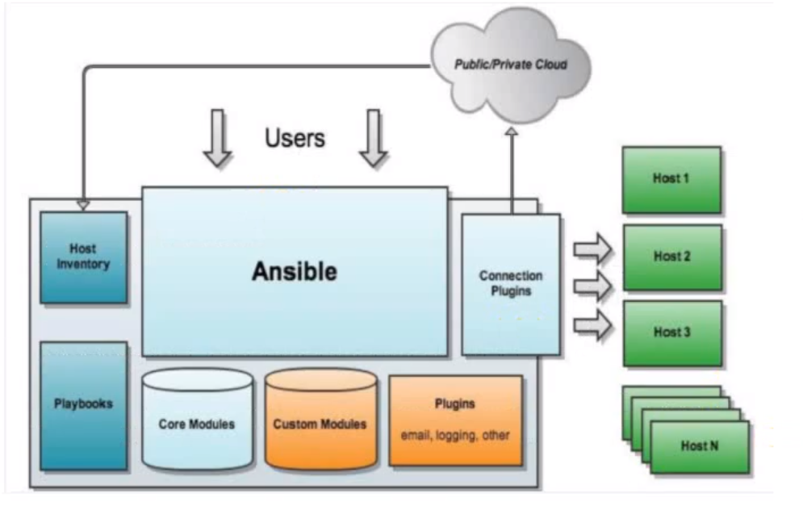

### 一、配置自动化场景

配置自动化可与帮助企业在大量服务器存在的情况下，快速实现应用部署、软件配置等一大利器，通过配置自动化可以在如下方面有优异表现：

- 提高配置效率
- 提高配置的精确度
- 降低人工参与度

### 二、配置自动化产品

ansible：开箱即用，使用ssh协议

### 三、ansible介绍

**一句话说明：无主从架构，开箱即用，用完即走**

> **工作原理图**

> **安装**

pass

> **主机清单**

**主机清单作用**

ansible controller在对主机进行操作时，仅认主机清单中定义的主机列表，即从主机清单中读取到主机列表时，才可以进行配置

- 用于ansible controller配置主机时读取主机列表
- 实现主机分组

**主机清单定义方法**

主机清单存储位置：`/etc/ansible/hosts`

- 方法一：直接在主机清单中写入主机IP或主机名（需要能够解析）

- 方法二：在主机清单文件中添加主机分组，然后把主机IP或主机名写入分组内即可