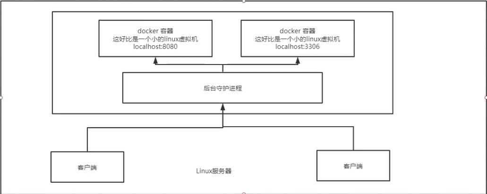
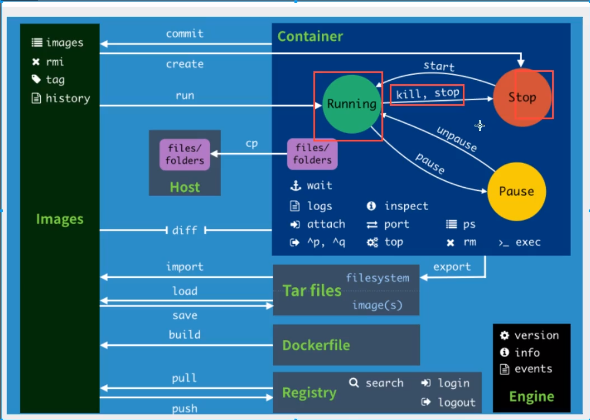
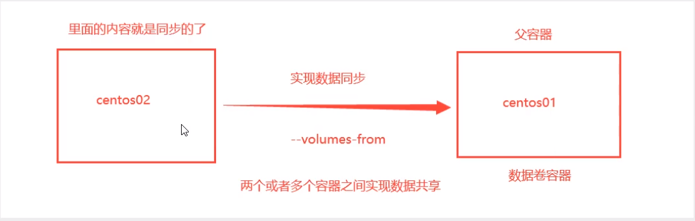
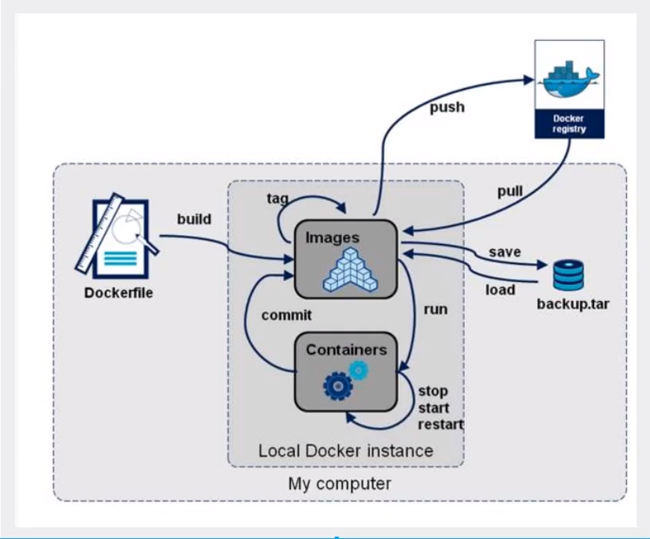
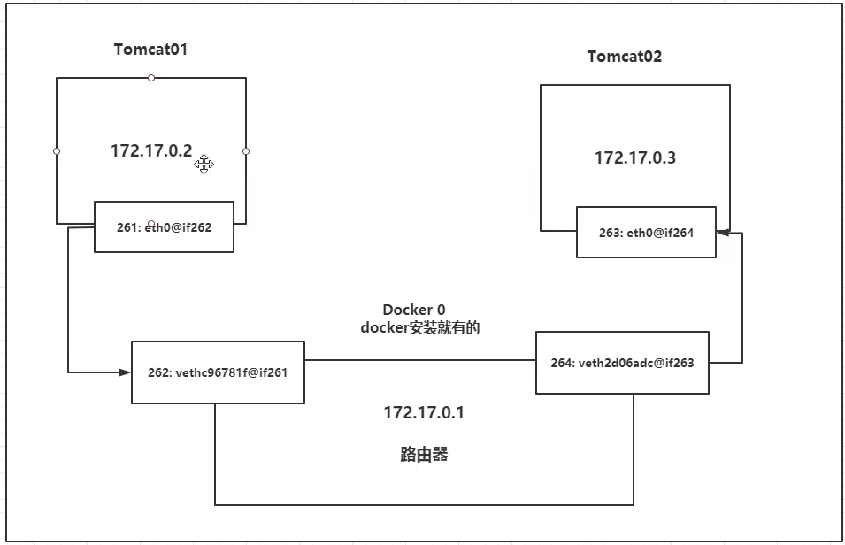
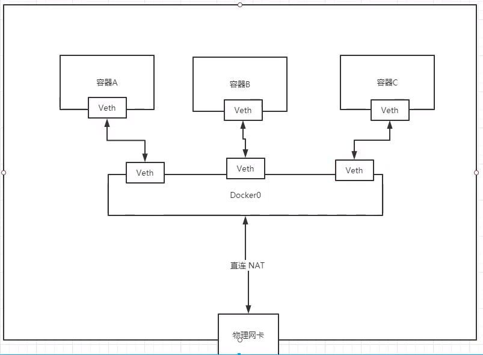

# Docker

> ## 概述

隔离：Docker通过隔离机制，将服务器利用到极致

官网：https://www.docker.com/

文档：https://docs.docker.com/

仓库地址：https://hub.docker.com/ 

> 与虚拟机的比较

- 传统虚拟机运行一个完整的操作系统，然后在系统上安装软件
- 每个容器之间互相隔离，互不影响

- 容器内的应用之间运行在宿主机的内核上，容器没有自己的内核

> ## 组成

**镜像**

**容器**

**仓库**

> ## 底层原理

**docker是怎么工作的**

docker是一个client-sever结构的系统，docker的守护进程运行在主机上，通过socket从客户端访问

server接收到client的指令，就执行这个命令




**docker为什么比VM快**

- Docker有着虚拟机更少的抽象层
- docker利用的是宿主机的内核，新建一个容器的时候，docker不需要像虚拟机一样重新加载一个操作系统内核，速度就快

> ## Docker的常用命令

```shell
docker info
docker version
docker --help


docker images   # 查看镜像
docker search   # 搜索镜像
docker pull     # 拉取镜像
docker push     # 推送镜像


docker run      # 启动镜像
# 参数说明
--name=""  容器名字
-d   后台方式运行
-it  使用交互式方式运行，进入容器查看内容
docker ps -a # 查看容器
docker rm # 删除容器
docker rmi # 删除镜像
docker exec -it -u # 进入容器,并开启一个新的终端
docker attach    # 进入容器正在运行的终端，不会开启新的进程
docker start # 启动容器
docker restart # 重启容器
docker stop # 停止正在运行的容器
docker kill  # 杀掉容器
```

> ## 进阶命令

```SHELL
# 查看日志
docker logs
# 查看容器内部的进程信息
docker top [ID]
# 查看镜像元数据
docker inspect
# 将容器内文件拷贝到主机
docker cp [containerid]:dir  dir
```



> ## 可视化

**portainer**

> ## Docker镜像

**镜像**

镜像是一种轻量级，可执行的独立软件包，用来打包软件运行环境和基于 运行环境开发的软件，它包含运行某个软件所需的所有内容，包括代码、环境变量、配置文件、库文件等等

**Docker镜像加载原理**

1、UnionFS(联合文件系统)

UnionFS是一种分层、轻量级并且高性能的文件系统，它支持对文件系统的修改作为一次提交来一层层的叠加，同时可以将不同目录挂载到同一个虚拟文件系统下，UnionFS是docker镜像的基础，镜像可以通过分层来进行继承，基于基础镜像，可以制作各种具体的应用镜像

2、Docker镜像加载原理

docker的镜像实际上由一层一层的文件系统组成，这种层级的文件系统叫UnionFS

bootfs(boot file system)主要包含bootloader和kernel,booloader主要是引导加载kernel的，linux刚启动时会加载bootfs文件系统，在Docker镜像的最底层是bootfs，这一层与典型的linux系统是一样的，包含boot加载器和内核，当boot加载完成之后整个内核都在内存中，此时内存的使用权已由bootfs转交给内核，此时系统也会卸载bootfs

rootfs(root file system),，在bootfs之上，包含的就是linux系统中的/dev,/proc,/bin,/etc等标准目录和文件，rootfs就是各种不同的操作系统发行版，

**平时装的虚拟机都是好几个G，为什么docker的只有200M**

对于一个精简的os，rootfs可以很小，只需要包含最基本的命令，工具和程序库就可以了 ，因为底层直接用host的kernel，自己只需要体统rootfs就可以了，由此对于不同的linux发行版，bootfs基本是一致的，rootfs会有差别，因此不同的发行版可以公用bootfs

**分层的理解**

所有的Docker镜像都是起始于一个基础镜像层，当进行修改或增加新的内容时，就会在当前镜像层之上创建新的镜像层

Docker镜像都是只读的，当容器启动时，一个新的可写层被加载到镜像的顶部，这一层就是我们通常说的容器层，容器之下的都是镜像层

**镜像的commit**

```shell
docker commit -m="提交哦啊的描述信息" -a="作者" 容器id 目标镜像名：[TAG]
```

> ## 容器数据卷

**概念**

Docker容器中产生的数据，同步到本地，这就是卷技术，即目录的挂载，将容器内的目录，挂载到linux上面

容器数据的持久化和同步操作，实现容器之间的数据共享

**使用方式**

```shell
#方式一：
docker run -it -v 主机目录：容器目录
```

**具名和匿名挂载**

- 匿名挂载：只指定了容器内的目录

```shell
docker run -it -v 容器目录
```

- 具名挂载：指定了卷名和容器内的目录，没指定主机目录的话，都会映射到`/var/lib/docker/volumes`目录下

```shell
docker run -it -v 卷名：容器目录
docker run -it -v 主机目录：容器目录 指定路径挂载

# 通过-v 容器内路径：ro/rw改变读写权限
ro  readonly
rw  readwrite
```
**数据卷容器**

多个容器之间同步数据 ： --volumes-from




> ## Dockerfile

**Dockerfile介绍**

Dockerfile就是用来构建docker镜像的构建脚本

构建步骤：

1、编写dockerfile

2、docker build构建镜像

3、docker run 运行镜像

4、docker push 推送到远端镜像仓库

**Dockerfile构建过程**

```dockerfile
#指令介绍
FROM     # 基础镜像，一切从这里开始构建
MAINTAINER    # 镜像的作者和维护者
RUN 	 # 构建的时候需要执行的shell命令
ADD		 # COPY文件，会自动解压
WORKDIR  # 镜像的工作目录
VOLUME   # 挂载的目录
EXPOSE   # 暴露端口
CMD      # 指定这个容器启动的时候运行的命令
ONBUILD  # 当构建一个被继承DockerFile，就会运行该指令
COPY     # 类似ADD，但是不会自动解压
ENV      # 构建的时候设置环境变量

```

**实战：构建centos**

```dockerfile
FROM centos
MAINTAINER   dxf<15797621351@163.com>

ENV MYPATH /usr/local
WORKDIR  $MYPATH


RUN yum -y install vim &&
    yum -y install net-tools

EXPOSE  80


CMD echo $MYPATH
CMD echo "----end----"
CMD /bin/bash

```

**实战：构建tomcat镜像**

pass

> ### 小结



> ### Docker网络

**理解Docker0**

每启动一个docker容器，docker就会给容器分配一个ip,只要安装docker，就会有一个网卡docker0，桥接模式，使用的技术是veth-pair

veth-pair就是一对的虚拟设备接口，他们都是成对出现的，一端连着协议，一端彼此相连，正式这个特性，veth-pair充当一个桥梁，连接各种虚拟网络设备，open Stack、docker容器之间的连接、ovs的连接，都是的使用的veth-pair技术



容器1和容器2是公用的一个路由器，docker0

所有的容器在不指定网络的情况下，都是 docker0路由的，docker会给容器分配一个默认的ip



**自定义网络**

网络模式

- bridge:桥接模式
- none:不配置网咯
- host:和宿主机共享网络


**实战：部署redis集群**

```shell
# 创建配置文件
#!/bin/sh

for port in $(seq 1 6);
do
mkdir -p /mydata/redis/node-${port}/conf
touch /mydata/redis/node-${port}/conf/redis.conf

cat << EOF >/mydata/redis/node-${port}/conf/redis.conf
port 6379
bind 0.0.0.0
cluster-enabled yes
cluster-config-file nodes.conf
cluster-node-timeout 5000
cluster-announce-ip 172.38.0.1${port}
cluster-announce-port 6379
cluster-announce-bus-port 16379
appendonly yes
EOF
done
# 创建6个redis容器
docker run -p 6376:6379 -p 16376:16379 --name redis-6 -v /mydata/redis/node-6/data:/data -v /mydata/redis/node-6/conf/redis.conf:/etc/redis/redis.conf -d --net redis --ip 172.38.0.16 redis:5.0.9-alpine3.11 redis-server /etc/redis/redis.conf

# 创建集群
redis-cli --cluster create 172.38.0.11:6379 172.38.0.12:6379 172.38.0.13:6379 172.38.0.14:6379 172.38.0.15:6379 172.38.0.16:6379 --cluster-replicas 1
```

> ### Docker Compose

**简介**

定义，运行多个容器

YAML file配置文件

**yaml规则**

```yaml
# 核心有三层
# 第一层
version: '' # 版本
# 第二层
services: 
	服务1: XX
		images
		build
		network
	服务2: XX
	
# 第三层
其他配置
volumes:
network:

```

实战

