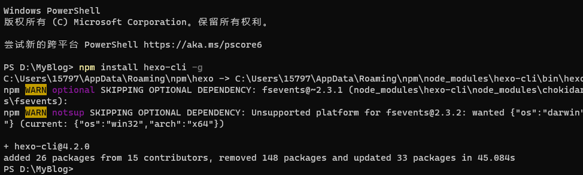
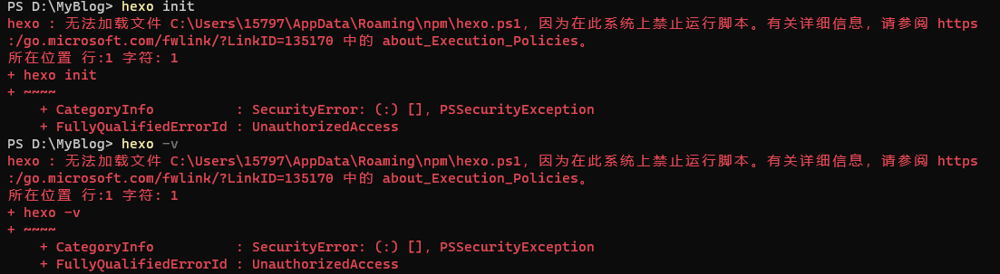
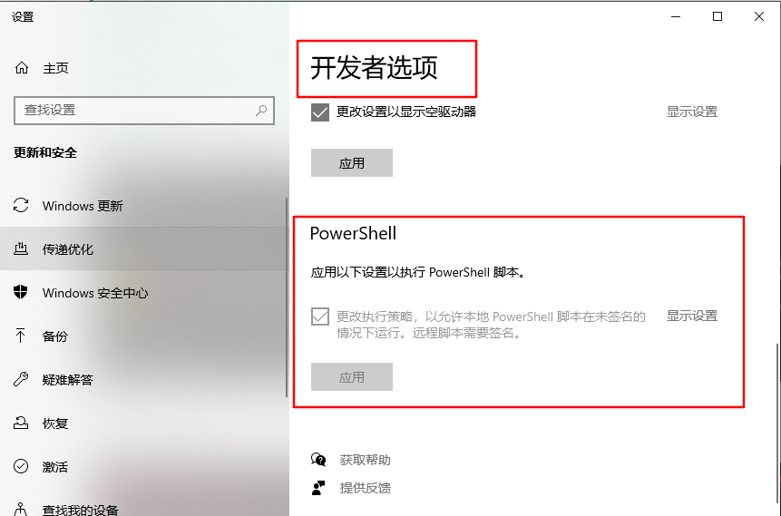
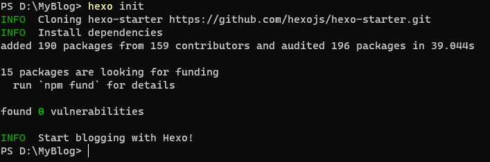
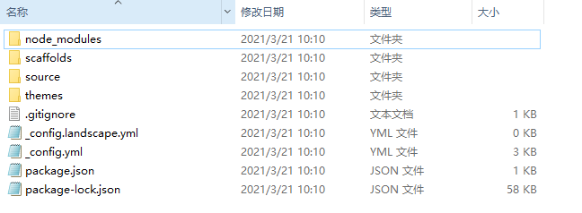
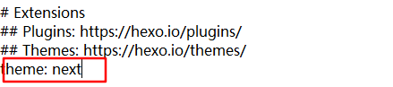
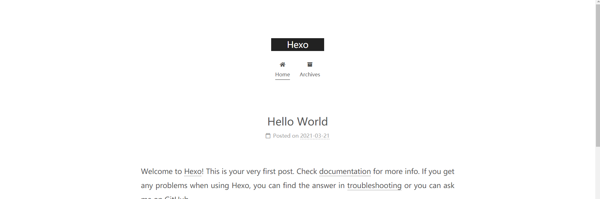
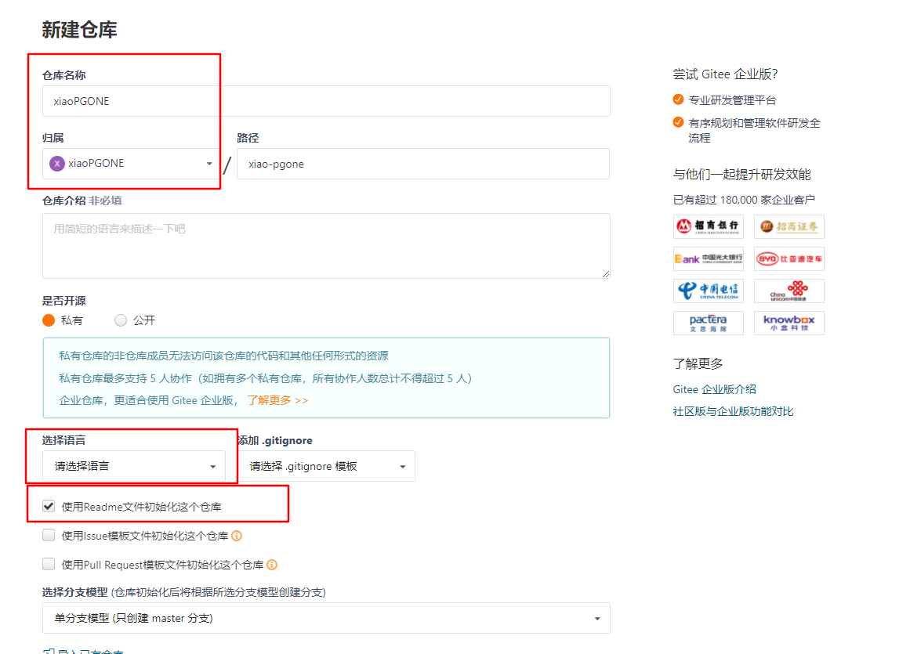
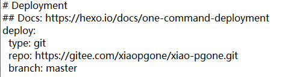
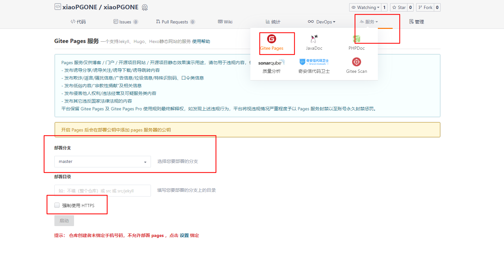

### 准备工作

> 安装git

....

> 安装nodejs

官网很慢，推荐下载地址：**http://nodejs.cn/download/**

> 新建工作目录

进入工作目录，安装hexo



初始化hexo模板

使用powershell报错



由于powershell默认不允许执行脚本，需要在设置中开启，在开发者选项中应用执行powershell脚本



再次执行hexo init



看到工作目录下已经生成了文件



### hexo主题

> 运行hexo

```shell
hexo clean # 清空已有hexo网站文件
hexo generate(or g) # 依据网页文本与新的CSS样式生成新网站文件
hexo server(or s) # 启动本地服务器，可以在localhost:4000查看网站修改效果
```

下载主题，使用next主题，在github上下载太慢，在gitee上找到有人fork的next仓库，从gitee上下载https://gitee.com/Lee-Li/hexo-theme-next

下载后，将压缩包解压到themes目录下，重命名为next

在工作目录下找到配置文件`_config.yml`，将主题更改为next




> 重新运行

```shell
hexo clean
hexo g
hexo s
```

> 显示效果



细节修改

pass


### Gitee配置

> 新建仓库



> 获取仓库地址

https://gitee.com/xiaopgone/xiao-pgone.git

> 修改配置文件中部署地址

修改`_config.yml`



> 部署博客

```shell
npm install hexo-deployer-git --save
hexo g --d  #一键部署
```
 
> 开启Page模式



